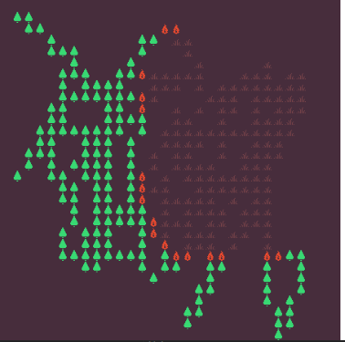

# LetsBurnTheForrest

Forrest Fire simulation

#### Technology: C# WPF

#### usage:

Program read forrest as a bmp file. File must be in the same folder as executable file.
- Red pixel - On Fire
- Green pixel - Tree
- Black pixel - Burnt
- White or other - Empty Field

- %Neighbor -> Inflammation from neigbor (propability 0 - 100)
- %Self -> self-inflammation (propability 0 - 100)
- %Renew -> renew a tree (propability 0 - 100)

